# Discord Onboarding 'Interested In' Flow

```mermaid
flowchart LR
    Start([Start]) --> Join[User Joins Discord Server]
    Join --> Navigate[User Navigates to<br/>'Start Here' Channel]
    Navigate --> Read[User Reads Documentation]
    Read --> Channels[User Goes to<br/>Channels & Roles Tab]
    Channels --> SelectTeam[User Selects Team<br/>They Are Interested In]
    SelectTeam --> EventFired[Event is Fired<br/>for the Bot to Handle. Roles are attached to User]
    EventFired --> CreateChannel[Bot Creates Unique Channel<br/>for User and Team Member]
    CreateChannel --> End([End])
    
    style Start fill:#4caf50,stroke:#2e7d32,stroke-width:3px,color:#fff
    style End fill:#4caf50,stroke:#2e7d32,stroke-width:3px,color:#fff
```

## Notes
- Channel created for user should only be visible to them and members of the team(s)
- There will be a 5-10 second delay after they select a team to avoid misclicks, spam clicking, and people rethinking what team they are interested in. 
    - May need to talk about how channels closed. 7 day automatic close?
- Need pre-frabricated messages for each team. If a team updates this we will need to do a whole redeploy of the bot based on how 
discord bots are updated. 
